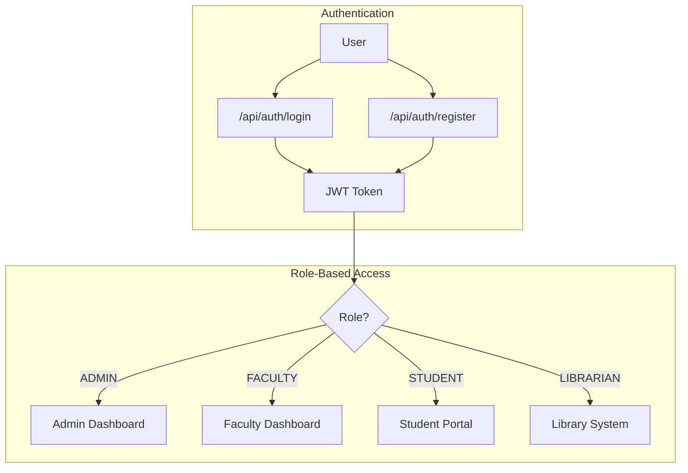
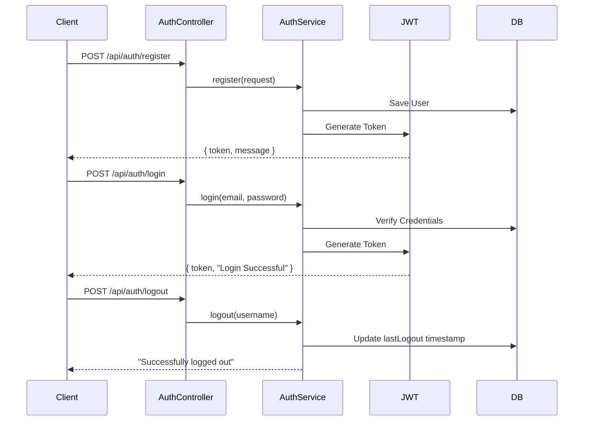
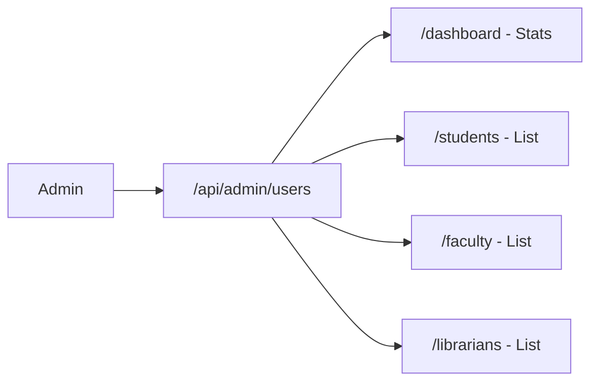
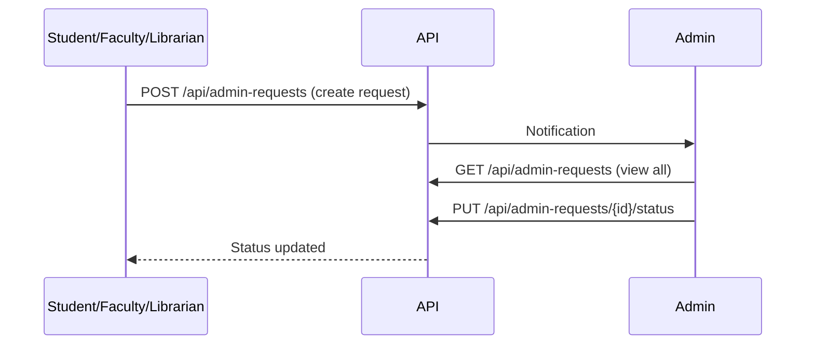
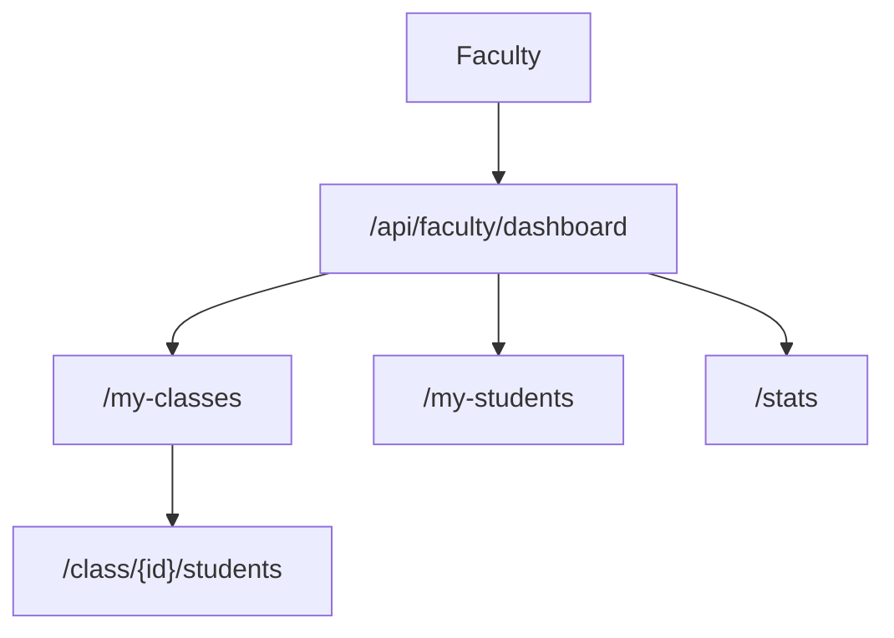
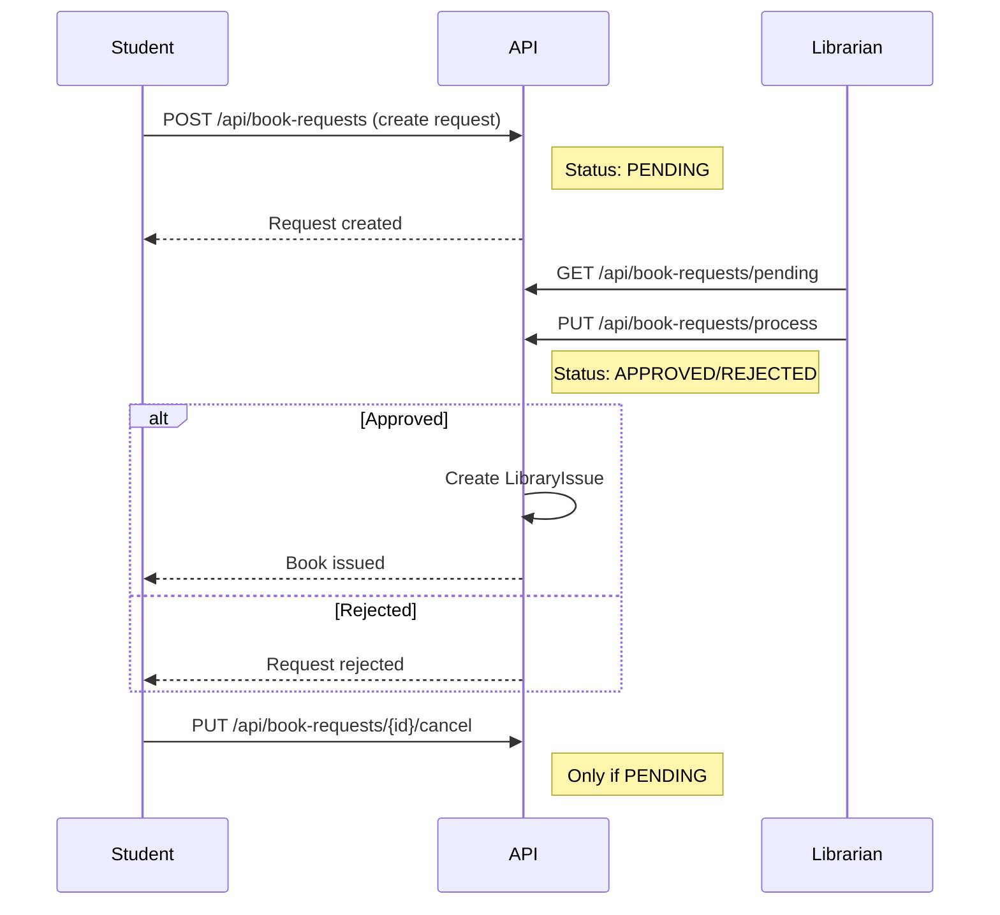
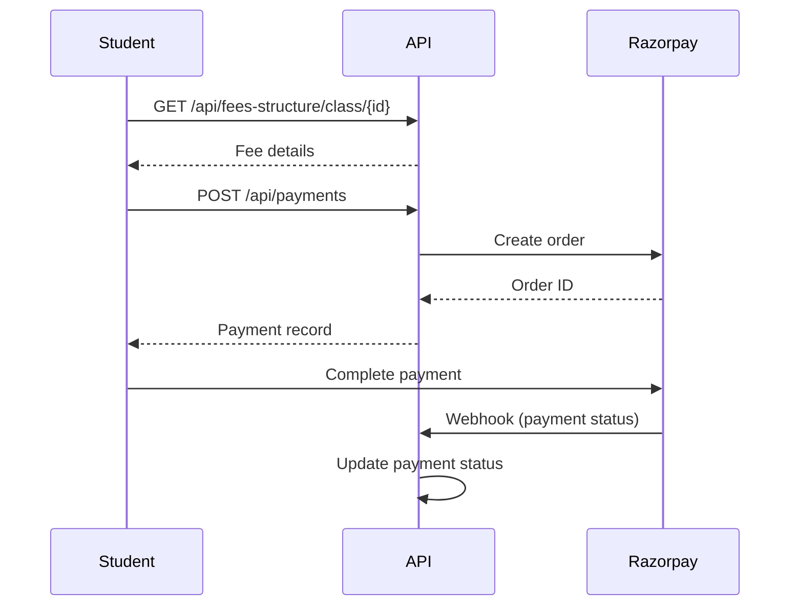
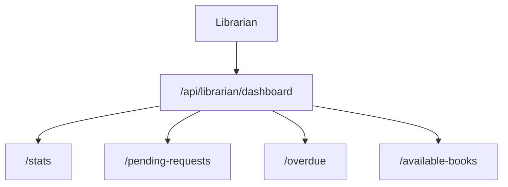

# SMS Core Service - Business Flow & Control Documentation

## System Overview

A comprehensive School Management System backend with JWT authentication, role-based access control, and modular architecture.



---

## User Roles & Permissions

| Role | Primary Functions |
|------|-------------------|
| **ADMIN** | Manage all users, view stats, process requests, manage classes/subjects |
| **FACULTY** | View assigned classes, manage students, record attendance/results |
| **STUDENT** | View classes, request books, make payments, view announcements |
| **LIBRARIAN** | Manage books, process book requests, track issues |

---

## 1. Authentication Flow



**Endpoints:**
| Method | Endpoint | Access | Description |
|--------|----------|--------|-------------|
| POST | `/api/auth/register` | Public | Register new user |
| POST | `/api/auth/login` | Public | Login and get JWT |
| POST | `/api/auth/logout` | Authenticated | Invalidate token |

---

## 2. Admin Business Flows

### 2.1 User Management



**Endpoints:**
| Method | Endpoint | Description |
|--------|----------|-------------|
| GET | `/api/admin/users/dashboard` | Get dashboard statistics |
| GET | `/api/admin/users/students` | Paginated student list |
| GET | `/api/admin/users/students/search` | Search students by name |
| GET | `/api/admin/users/faculty` | Paginated faculty list |
| GET | `/api/admin/users/faculty/search` | Search faculty by name |
| GET | `/api/admin/users/librarians` | Paginated librarian list |

### 2.2 Admin Request Handling



---

## 3. Faculty Business Flows

### 3.1 Dashboard & Class Management



**Endpoints:**
| Method | Endpoint | Description |
|--------|----------|-------------|
| GET | `/api/faculty/dashboard/my-classes` | Classes assigned to faculty |
| GET | `/api/faculty/dashboard/my-students` | All students in assigned classes |
| GET | `/api/faculty/dashboard/class/{id}/students` | Students in specific class |
| GET | `/api/faculty/dashboard/stats` | Faculty dashboard statistics |

### 3.2 Attendance & Results

| Method | Endpoint | Access |
|--------|----------|--------|
| POST | `/api/attendance` | FACULTY - Record attendance |
| GET | `/api/attendance/student/{id}` | FACULTY/STUDENT - View attendance |
| POST | `/api/results` | FACULTY - Record results |
| GET | `/api/results/student/{id}` | STUDENT - View results |

---

## 4. Student Business Flows

### 4.1 Book Request Workflow



**Book Request Endpoints:**
| Method | Endpoint | Role | Description |
|--------|----------|------|-------------|
| POST | `/api/book-requests` | STUDENT | Create book request |
| GET | `/api/book-requests/my-requests` | STUDENT | View own requests |
| PUT | `/api/book-requests/{id}/cancel` | STUDENT | Cancel pending request |
| GET | `/api/book-requests/pending` | LIBRARIAN | View pending requests |
| PUT | `/api/book-requests/process` | LIBRARIAN | Approve/reject request |

### 4.2 Payment Flow



---

## 5. Library Business Flows

### 5.1 Librarian Dashboard



### 5.2 Book Management

| Method | Endpoint | Description |
|--------|----------|-------------|
| POST | `/api/books` | Add new book (LIBRARIAN only) |
| GET | `/api/books` | List all books |
| GET | `/api/books/available` | Books with copies available |
| GET | `/api/books/search/title?title=` | Search by title |
| GET | `/api/books/search/author?author=` | Search by author |
| DELETE | `/api/books/{id}` | Delete book (LIBRARIAN only) |

### 5.3 Library Issue Tracking

| Method | Endpoint | Description |
|--------|----------|-------------|
| POST | `/api/library-issues` | Issue book to user |
| PUT | `/api/library-issues/{id}/return` | Mark book returned |
| GET | `/api/library-issues/overdue` | View overdue books |

---

## 6. Supporting Modules

### Classes & Subjects
| Endpoint | Description |
|----------|-------------|
| `/api/classes` | CRUD operations on classes |
| `/api/subjects` | CRUD operations on subjects |
| `/api/courses` | CRUD operations on courses |

### Events & Announcements
| Endpoint | Description |
|----------|-------------|
| `/api/events` | Create and manage school events |
| `/api/announcements` | Role-specific announcements |
| `/api/announcements/my` | View announcements for current role |

### Exams & Results
| Endpoint | Description |
|----------|-------------|
| `/api/exams` | Create and manage exams |
| `/api/results` | Record and view results |

---

## API Structure Summary

```
/api
├── /auth                 # Public: Login, Register, Logout
├── /admin
│   └── /users            # Admin: User management
├── /admin-requests       # All roles: Request to admin
├── /faculty/dashboard    # Faculty: Dashboard & classes
├── /librarian/dashboard  # Librarian: Library stats
├── /books                # All roles: Book catalog
├── /book-requests        # Student/Librarian: Book requests
├── /library-issues       # Librarian: Track issued books
├── /payments             # Admin/Student: Fee payments
├── /classes              # Admin/Faculty: Class management
├── /subjects             # Admin: Subject management
├── /courses              # Admin: Course management
├── /attendance           # Faculty/Student: Attendance
├── /results              # Faculty/Student: Exam results
├── /exams                # Admin/Faculty: Exam management
├── /events               # All: School events
├── /announcements        # All: Announcements
└── /fees-structure       # Admin: Fee configuration
```

---

## Test Data Summary

Pre-loaded test users (password: `Password@123`):

| Role | Email | Purpose |
|------|-------|---------|
| Admin | `admin@sms.edu.in` | Full system access |
| Faculty | `john.smith.F001@sms.edu.in` | Math teacher |
| Faculty | `jane.doe.F002@sms.edu.in` | English teacher |
| Student | `alice.johnson.S001@sms.edu.in` | Class 10-A |
| Student | `bob.wilson.S002@sms.edu.in` | Class 10-A |
| Librarian | `mary.lib.L001@sms.edu.in` | Library access |

---

## Quick Start Testing

1. **Start the app**: `.\mvnw.cmd spring-boot:run`
2. **Access Swagger**: `http://localhost:8080/swagger-ui.html`
3. **Login as Admin**: POST to `/api/auth/login` with admin credentials
4. **Use JWT**: Add `Authorization: Bearer <token>` header to requests
